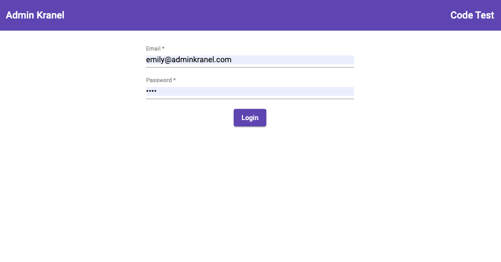
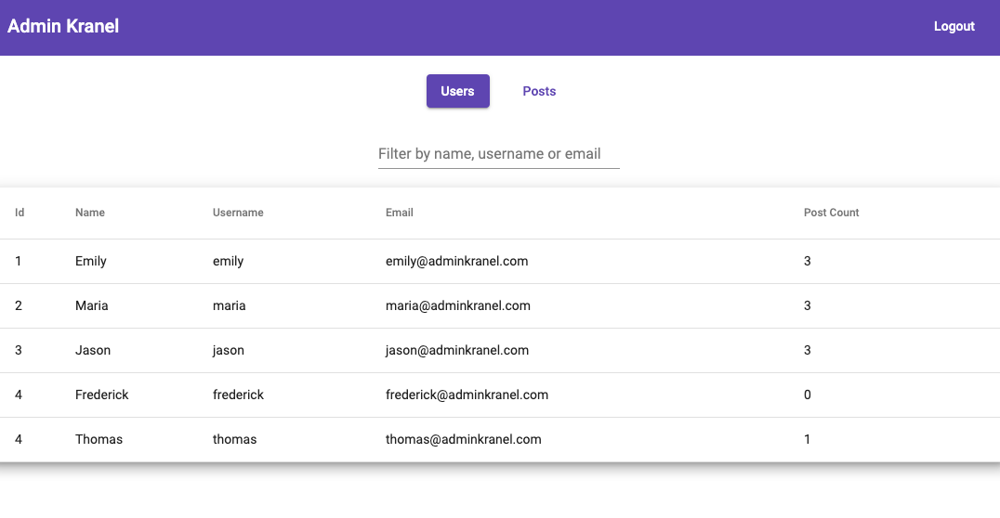
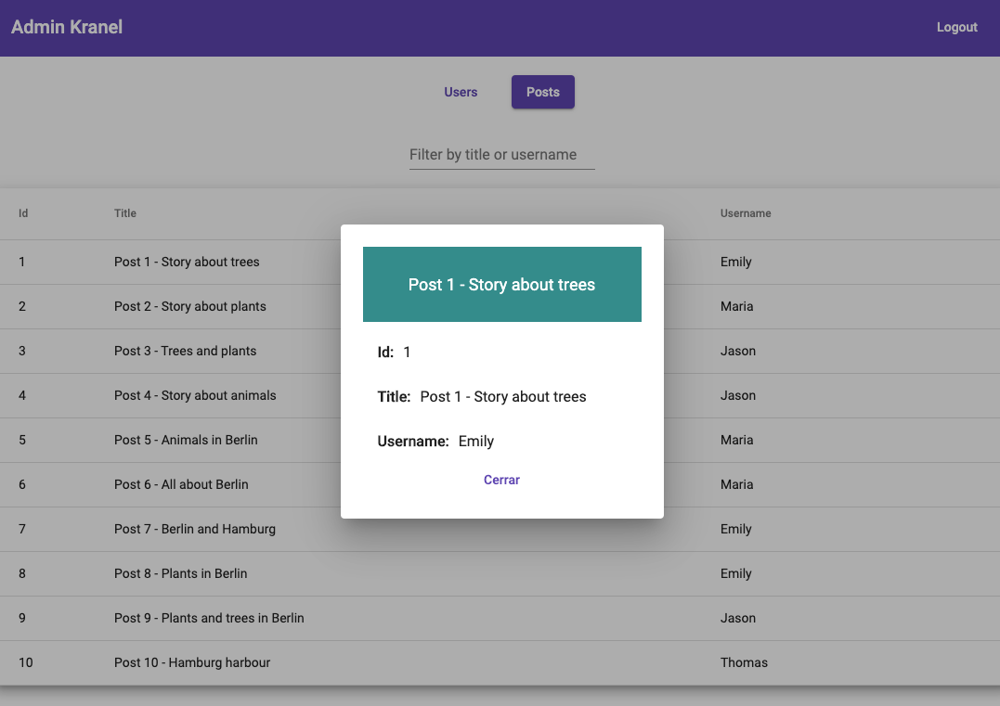

# AdminKranel

Simple admin project with Angular 8.

In order to run it, you need Angular CLI installed in your system: https://cli.angular.io/

## Basic commands

Install dependencies:

`npm install`

Run:

`ng s`

Test:

`ng test`

Code coverage:

`ng test --no-watch --code-coverage`

## Features

The project consists of 3 main layouts:
- **Login component**. The panel is under an Auth Guard with a dummy user. The user must be 'emily@adminkranel.com' and it's password: 'hola'. User data is stored in *LocalStorage*.
- **Users list**. Shows a list of users. When you click in one user a dialog is opened with the user data. The data is retrieved from the API endpoint.
- **Posts list**. Shows a list of posts. Again, when you click in one post a dialog is opened with the post data. The data is also retrieved from the API endpoint.

## Screenshoots

1. Login View

  

2. User List View

  

2. Post Item View

  

